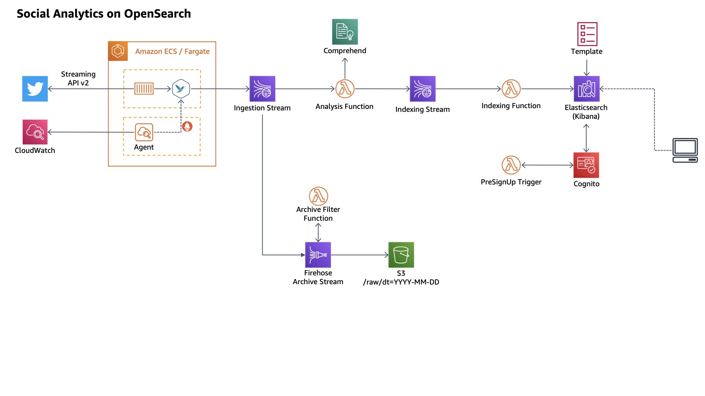

# Social Analytics on OpenSearch



## Preparation before deployment

### Create service-linked IAM Role for Amazon ECS

If you use AWS ECS first time, you need to create service-linked roles.

```bash
aws iam create-service-linked-role --aws-service-name ecs.amazonaws.com
```

## How to Buid & Deploy

```bash
export TWITTER_BEARER_TOKEN=xxxxxxxxxxxxxxxxxxxx
npx projen
npj projen deploy
```

## Apply user dictionary

```
PUT _component_template/kuromoji_user_dic
{
  "template": {
    "settings": {
      "index": {
        "analysis": {
          "analyzer": {
            "kuromoji_user_dic": {
              "type": "kuromoji",
              "user_dictionary": "analyzers/F210539969",
              "filter": ["synonym"]
            }
          },
          "filter": {
            "synonym": {
              "type": "synonym",
              "synonyms_path": "analyzers/F171096003"
            }
          }
        }
      }
    }
  }
}
```